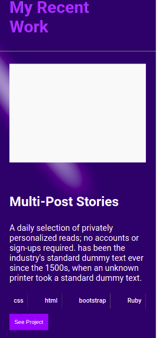
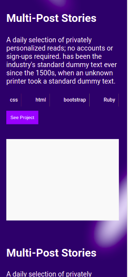

# My Porfolio

A Porfolio to help showcase my skills and achievments to employers

## Screenshots







## Built With

- HTML
- CSS

## Demo

https://wuyepabdul.github.io/microverse-porfolio/

## Getting Started

Clone the project

```bash
  git clone https://github.com/wuyepabdul/microverse-porfolio
```

Go to the project directory

```bash
  cd hello-microverse
```

Run the project

```bash
  Right click and choose Open file in browser or live server

```

## Authors

- GitHub:[@Wuyep Abdul](https://www.github.com/wuyepabdul)
- GitHub: [@ifnotlily](https://github.com/ifnotlily)

## License

This project is [MIT](https://choosealicense.com/licenses/mit/) licensed
